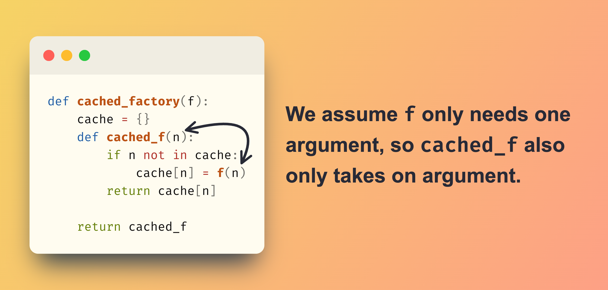

# Fixed number of arguments

The problem lies in the decorator `cached_factory`:

```py
def cached_factory(f):
    cache = {}
    def cached_f(n):
        if n not in cache:
            cache[n] = f(n)
        return cache[n]

    return cached_f
```

Note how the inner function `cached_f` only accepts one argument `n`, which is then passed into the function `f`:



You are assuming that the functions decorated by `cached_factory` only accept a single argument, and that assumption is baked right into your code!
However, the function `combinations_len` accepts two arguments, so that's why the decorator `cached_factory` doesn't work...

But hey, you can just fix it by changing the number of arguments that `cached_f` accepts, right?

```py
def cached_factory_two(f):
    cache = {}
    def cached_f(a, b):
        if (a, b) not in cache:
            cache[a, b] = f(a, b)
        return cache[a, b]

    return cached_f
```

This works, but now you have two decorators that are essentially the same...


Surely, there must be a way to write a single decorator that handles these two cases?
Better yet, there must be a way to write a single decorator that handles functions with arbitrary numbers of arguments, right?
