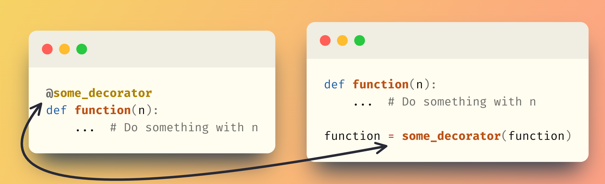

# Decorator syntax

In Python, you usually use the at sign `@` to apply a decorator to a function.
And when you do that, the at sign `@` really looks like the cherry on top of your function; it's something to help make your function even more incredible.

But you have to understand that the at sign `@` itself doesn't do anything special that is _new_.
When you first wrote your factory of cached functions you didn't use the at sign `@` and you were _already_ writing and using decorators.
You didn't know it, but that was already it.
So, it's not the at sign `@` that makes the decorator, it's the _usage pattern_.

Using a decorator with `@` when defining the function or manually by reassigning the variable is equivalent.
It looks different, but it's exactly the same thing.
You can say that the at sign `@` is just syntactic sugar.



In fact, the at sign `@` can only be used to apply a decorator if you have access to the definition of the function, and that's because the at sign `@` must be used above a function definition `def`.

If you don't have access to the definition of the function, for example if you are importing it from another module, then you have to pass the function to the decorator by hand:

```py
from math import factorial

factorial = cached_factory(factorial)
```

But this is what you were doing already!
So, you _did_ write and use decorators already.
